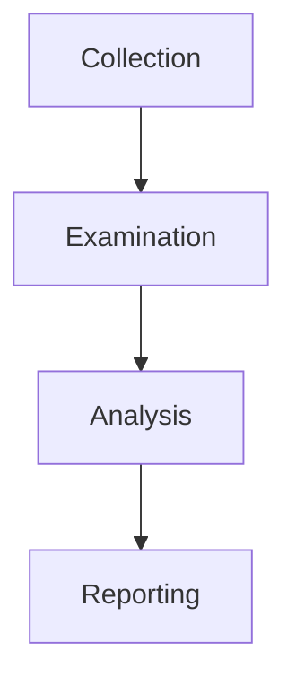
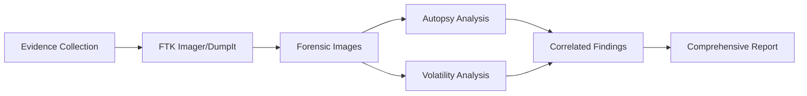

# Digital Forensics - Comprehensive Notes

## 1. Introduction to Digital Forensics

### Definition and Scope
> **Digital Forensics**: Application of scientific methods and procedures to investigate cyber crimes involving digital devices.

**Key Concepts:**
- **Cyber Crime**: Criminal activity conducted using digital devices
- **Digital Evidence**: Information stored or transmitted in digital form
- **Legal Proceedings**: Evidence used in court cases

### Real-World Case Example: Bank Robbery Investigation

**Evidence Collected from Suspect's Devices:**
| Device | Evidence Found | Significance |
|--------|----------------|--------------|
| **Laptop** | Digital map of bank | Robbery planning evidence |
| **Hard Drive** | Entrance/escape routes document | Premeditation proof |
| **Hard Drive** | Security controls bypass plans | Criminal intent demonstration |
| **Laptop** | Photos/videos of previous robberies | Pattern of criminal behavior |
| **Mobile Phone** | Illegal chat groups & call records | Conspiracy evidence |

**Investigation Impact:**
- All evidence supported legal proceedings
- Demonstrated premeditation and planning
- Established connection to criminal network

---

## 2. Digital Forensics Process (NIST Framework)

### Four-Phase Methodology



### Phase 1: Collection

**Objective**: Secure and preserve original evidence without tampering

**Key Activities:**
- Identify all potential evidence sources (computers, mobile devices, storage media)
- Document device details and physical condition
- Maintain evidence integrity through proper handling

**Challenges:**
- Large volumes of potential evidence
- Risk of evidence alteration during collection
- Legal requirements for evidence handling

### Phase 2: Examination

**Objective**: Filter and extract relevant data from collected evidence

**Practical Examples:**
```
Scenario: Digital camera with 10,000 photos
Requirement: Only need photos from specific date range
Action: Filter by timestamp, extract relevant subset

Scenario: Multi-user computer system
Requirement: Investigate specific user account
Action: Isolate user profile, extract user-specific data
```

**Examination Techniques:**
- Data filtering based on timeframes, file types, keywords
- Deleted file recovery
- Metadata extraction
- Hash analysis for file identification

### Phase 3: Analysis

**Objective**: Correlate evidence to reconstruct events and draw conclusions

**Analysis Methods:**
- **Timeline Analysis**: Chronological reconstruction of events
- **Data Correlation**: Connecting evidence from multiple sources
- **Behavioral Analysis**: Understanding user/attacker patterns
- **Impact Assessment**: Determining scope and consequences

**Case Example Analysis:**
```
Evidence: Bank map + Security bypass plans + Communication records
Correlation: Shows coordinated planning among multiple parties
Conclusion: Organized criminal activity with specific targets
```

### Phase 4: Reporting

**Objective**: Document findings for legal and management audiences

**Report Components:**
- **Executive Summary**: High-level overview for non-technical readers
- **Methodology**: Detailed explanation of investigation process
- **Findings**: Specific evidence discovered and its significance
- **Recommendations**: Suggestions for prevention and improvement

**Audience Considerations:**
- **Law Enforcement**: Focus on legal admissibility and chain of evidence
- **Executive Management**: Business impact and risk mitigation
- **Technical Teams**: Detailed technical findings and remediation steps

---

## 3. Types of Digital Forensics

### Specialized Investigation Areas

#### Computer Forensics
- **Focus**: Desktop computers, laptops, workstations
- **Common Evidence**: User files, system logs, internet history
- **Tools**: FTK Imager, Autopsy, EnCase

**Investigation Scope:**
- File system analysis
- Registry examination
- Application usage patterns
- System configuration review

#### Mobile Forensics
- **Focus**: Smartphones, tablets, mobile devices
- **Common Evidence**: Call records, messages, GPS data, app data
- **Challenges**: Device encryption, cloud synchronization

**Key Data Sources:**
- Call logs and contact lists
- SMS/MMS messages
- Location history
- Social media applications
- Photo and video metadata

#### Network Forensics
- **Focus**: Network infrastructure and traffic
- **Common Evidence**: Packet captures, firewall logs, IDS alerts
- **Investigation**: Communication patterns, intrusion detection

**Analysis Methods:**
- Traffic pattern analysis
- Protocol analysis
- Intrusion detection system logs
- Network flow data examination

#### Database Forensics
- **Focus**: Database management systems
- **Common Evidence**: Unauthorized access, data manipulation
- **Techniques**: Transaction log analysis, data integrity checks

**Investigation Areas:**
- User access patterns
- Data modification history
- Privilege escalation attempts
- Data exfiltration evidence

#### Cloud Forensics
- **Focus**: Cloud infrastructure and services
- **Challenges**: Limited physical access, multi-tenancy
- **Evidence**: API logs, access records, configuration changes

**Unique Considerations:**
- Jurisdictional issues
- Data ownership complexities
- Provider cooperation requirements
- Shared responsibility model

#### Email Forensics
- **Focus**: Email communication systems
- **Common Investigations**: Phishing, fraud, harassment
- **Analysis**: Header examination, content analysis, attachment review

**Key Evidence:**
- Email headers (routing information)
- Message content and attachments
- Server logs and access records
- User account activity

---

## 4. Evidence Acquisition Procedures

### Legal and Procedural Requirements

#### Proper Authorization
**Importance**: Evidence collected without authorization may be inadmissible in court

**Authorization Documentation:**
- Search warrants
- Court orders
- Organizational consent forms
- Legal compliance verification

**Considerations:**
- Scope of authorization (what can be searched)
- Jurisdictional boundaries
- Privacy law compliance (GDPR, CCPA, etc.)

#### Chain of Custody

**Definition**: Formal documentation tracking evidence handling from collection to presentation

**Chain of Custody Document Elements:**
```
Evidence Description:
- Item name and type
- Serial numbers, unique identifiers
- Physical condition notes

Collection Details:
- Collector names and credentials
- Date, time, location of collection
- Collection method used

Storage and Access:
- Storage location records
- Access logs (who, when, why)
- Transportation records

Integrity Verification:
- Hash values for digital evidence
- Tamper-evident sealing records
- Continuity verification
```

**Practical Example:**
```
Case: USB drive evidence
Chain of Custody:
1. Collected by Officer Smith, 2024-06-05 14:30
2. Sealed in evidence bag #457
3. Stored in evidence locker #3
4. Accessed by Analyst Jones, 2024-06-06 09:15 for analysis
5. Hash verified before and after analysis (match confirmed)
```

#### Write Blockers

**Purpose**: Prevent alteration of original evidence during acquisition

**Types of Write Blockers:**
- **Hardware Write Blockers**: Physical devices between evidence and analysis system
- **Software Write Blockers**: Applications that intercept write commands

**Why Use Write Blockers:**
- Preserve original file timestamps
- Prevent accidental modification
- Maintain evidence integrity for court
- Block automated system writes (updates, temporary files)

**Implementation Example:**
```
Scenario: Acquiring evidence from suspect's hard drive
Without Write Blocker:
- System updates might modify access times
- Temporary files could overwrite deleted data
- File system journaling might alter metadata

With Write Blocker:
- Original drive remains completely unchanged
- All timestamps and metadata preserved
- Evidence integrity maintained for legal proceedings
```

---

## 5. Windows Forensics

### Evidence Acquisition Strategy

#### Two Critical Image Types

##### 1. Disk Imaging (Non-Volatile Evidence)
**What**: Complete bit-by-bit copy of storage media
**Preservation**: Survives system restart/shutdown
**Evidence Includes**: Files, documents, browsing history, system logs

##### 2. Memory Imaging (Volatile Evidence)
**What**: Copy of RAM contents at time of acquisition
**Criticality**: Must be captured first (lost on power loss)
**Evidence Includes**: Running processes, open files, network connections, encryption keys

### Acquisition Priority Protocol
```
1. Memory Image (immediately - before any system interaction)
2. Disk Image (after memory capture)
3. Network connections (if applicable)
4. External device analysis
```

### Forensic Tools Ecosystem

#### Acquisition Tools

##### FTK Imager
**Primary Use**: Disk image acquisition and preliminary analysis
**Features**:
- User-friendly graphical interface
- Multiple image format support (E01, DD, AFF)
- Integrity verification (hash generation)
- Quick preview of evidence content

**Practical Usage:**
```
Scenario: Suspect's laptop acquisition
Steps:
1. Connect write blocker to suspect drive
2. Use FTK Imager to create forensic image
3. Generate MD5/SHA hashes for integrity
4. Store image on forensic workstation
```

##### DumpIt
**Primary Use**: Memory image acquisition from Windows systems
**Features**:
- Command-line utility for simplicity
- Minimal footprint on target system
- Rapid memory capture capability
- Compatible with analysis tools

**Usage Example:**
```
Command: DumpIt.exe /output C:\evidence\memory.dmp
Result: Complete RAM capture saved to specified location
```

#### Analysis Tools

##### Autopsy
**Primary Use**: Comprehensive disk image analysis
**Key Features**:
- **Keyword Search**: Find specific text across entire image
- **Deleted File Recovery**: Carve and restore deleted content
- **File Metadata**: Examine timestamps, ownership, permissions
- **Extension Mismatch Detection**: Identify disguised files
- **Timeline Analysis**: Chronological event reconstruction

**Analysis Workflow:**
1. Import disk image into Autopsy
2. Run automated analysis modules
3. Examine file system structure
4. Recover and analyze deleted content
5. Generate comprehensive report

##### Volatility
**Primary Use**: Advanced memory image analysis
**Key Capabilities**:
- Process listing and analysis
- Network connection reconstruction
- DLL and driver examination
- Registry extraction from memory
- Malware detection and analysis

**Plugin Examples:**
```
volatility -f memory.dmp imageinfo        # Identify OS profile
volatility -f memory.dmp pslist           # List running processes
volatility -f memory.dmp netscan          # Network connections
volatility -f memory.dmp malfind          # Malware detection
```

### Windows-Specific Artifacts

#### Common Evidence Locations
- **Registry Hives**: User activity, system configuration
- **Event Logs**: System, security, application events
- **Prefetch Files**: Program execution history
- **Browser Artifacts**: Internet activity, downloads, cookies
- **Recycle Bin**: Deleted file metadata and content

#### Timeline Analysis Example
```
Event Reconstruction:
10:15 AM - User logs into system
10:20 AM - USB device connected
10:25 AM - Suspicious executable run from USB
10:30 AM - Network connections to unknown IP
10:35 AM - Files copied to external storage
10:40 AM - USB device disconnected
```

### Tool Integration in Investigation Workflow



This comprehensive digital forensics framework provides the methodology, tools, and procedures necessary for conducting thorough investigations while maintaining evidence integrity for legal proceedings.