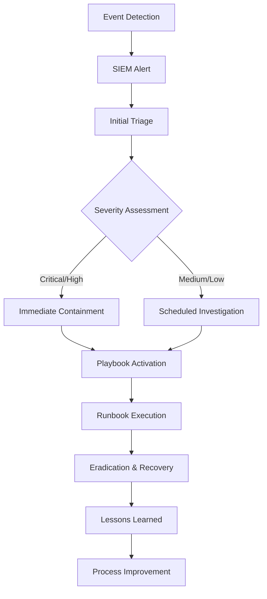

# Security Incidents & Incident Response - Comprehensive Notes

## 1. Understanding Security Events and Alerts

### The Foundation: Events and Processes

**Process Types on Digital Devices:**
- **Interactive Processes**: User-initiated actions (games, videos, applications)
- **Non-Interactive Processes**: Background system operations (updates, services, maintenance)

**Event Generation:**
```
Process Activity → Event Logging → Security Analysis → Alert Generation
```

### Alert Classification: False vs. True Positives

#### False Positive Example
```
Alert: High data transfer to external IP
Analysis: System backup to cloud storage
Conclusion: Legitimate activity → False Positive
Impact: Wasted investigation resources
```

#### True Positive Example
```
Alert: Phishing email detected
Analysis: Malicious attachment, social engineering attempt
Conclusion: Actual threat → True Positive → Incident
Impact: Potential system compromise prevented
```

### Incident Severity Classification

| Severity Level | Impact Description | Response Priority | Example |
|----------------|-------------------|-------------------|---------|
| **Critical** | System compromise, data breach | Immediate (minutes) | Ransomware encryption, data exfiltration |
| **High** | Significant system impact | High (1-2 hours) | Malware infection, unauthorized access |
| **Medium** | Limited impact, contained | Medium (4-8 hours) | Policy violation, suspicious activity |
| **Low** | Minimal impact, informational | Scheduled (24 hours) | False positive, minor policy issue |

**Prioritization Rationale:**
- Critical: Active damage occurring
- High: Potential for significant harm
- Medium: Requires investigation but contained
- Low: Administrative or informational

---

## 2. Types of Security Incidents

### Comprehensive Incident Taxonomy

#### 1. Malware Infections
**Definition**: Malicious software designed to damage or disrupt systems

**Common Malware Types:**
- **Ransomware**: Encrypts files for ransom
- **Trojans**: Disguised as legitimate software
- **Spyware**: Secretly monitors user activity
- **Worms**: Self-replicating across networks

**Infection Vectors:**
- Malicious email attachments
- Compromised websites
- Infected removable media
- Software vulnerabilities

**Real-World Example:**
```
Case: WannaCry Ransomware Attack (2017)
Impact: 200,000+ computers across 150 countries
Vector: Exploited Windows SMB vulnerability
Containment: Emergency patches, network segmentation
```

#### 2. Security Breaches
**Definition**: Unauthorized access to confidential systems or data

**Breach Methods:**
- Credential theft/phishing
- System vulnerabilities
- Social engineering
- Physical access compromise

**Impact Assessment:**
```
Confidentiality Impact: Data exposure risk
Integrity Impact: Data manipulation potential
Availability Impact: Service disruption possibility
```

**Case Study:**
```
Organization: Financial institution
Breach: Attackers accessed customer database via SQL injection
Data Exposed: 500,000 customer records including PII
Response: Notification, credit monitoring, security overhaul
```

#### 3. Data Leaks
**Definition**: Unintentional or intentional exposure of sensitive information

**Leak Categories:**
- **Intentional**: Malicious insider, external attacker
- **Unintentional**: Human error, misconfigurations

**Common Leak Scenarios:**
- Misconfigured cloud storage (S3 buckets)
- Email sent to wrong recipient
- Public code repositories with secrets
- Lost/stolen devices with unencrypted data

**Prevention Framework:**
```
Data Classification → Access Controls → Monitoring → Encryption → Training
```

#### 4. Insider Attacks
**Definition**: Malicious actions by authorized personnel

**Insider Profiles:**
- **Disgruntled Employees**: Intentional harm
- **Careless Users**: Unintentional negligence
- **Compromised Accounts**: Credential theft

**Detection Challenges:**
- Legitimate access makes detection difficult
- Behavioral analysis required
- Trust relationships exploited

**Mitigation Strategies:**
- Principle of least privilege
- User activity monitoring
- Separation of duties
- Exit procedures for departing employees

#### 5. Denial of Service (DoS) Attacks
**Definition**: Attacks rendering services unavailable to legitimate users

**Attack Types:**
- **Volume-Based**: Flooding with traffic
- **Protocol-Based**: Exploiting protocol weaknesses
- **Application-Layer**: Targeting specific applications

**DDoS Evolution:**
```
Traditional DoS → Distributed DoS → Amplification Attacks → IoT Botnets
```

**Impact Assessment Example:**
```
Organization: E-commerce website
Attack: 100 Gbps DDoS during holiday sale
Impact: $500,000/hour in lost revenue
Response: DDoS mitigation service activation
```

### Organizational Impact Variability

**Context-Dependent Severity:**
```
Example 1: Data Leak
- Marketing Agency: Low impact (public data)
- Healthcare Provider: Critical impact (PHI exposure)

Example 2: DoS Attack
- Blog: Medium impact (temporary unavailability)
- Online Retailer: Critical impact (revenue loss)
```

**Risk Assessment Formula:**
```
Risk = Likelihood × Impact
Impact = (Confidentiality + Integrity + Availability) × Business Criticality
```

---

## 3. Incident Response Frameworks

### SANS PICERL Framework

#### Phase 1: Preparation
**Objective**: Build capability to handle incidents effectively

**Preparation Activities:**
- **Team Development**: IR team staffing and training
- **Tool Acquisition**: Security solutions deployment
- **Policy Creation**: IR plan documentation
- **Training**: Employee awareness programs

**Preparation Metrics:**
- IR team response time benchmarks
- Tool coverage percentage
- Training completion rates
- Tabletop exercise frequency

#### Phase 2: Identification
**Objective**: Detect and confirm security incidents

**Identification Techniques:**
- **Automated Detection**: SIEM alerts, EDR notifications
- **Manual Discovery**: User reports, system monitoring
- **Threat Intelligence**: IOC matching, anomaly detection

**Identification Workflow:**
```
Alert Received → Triage Analysis → Validation → Classification → Escalation
```

#### Phase 3: Containment
**Objective**: Limit incident impact and prevent spread

**Containment Strategies:**
- **Short-term**: Immediate isolation (network disconnect)
- **Long-term**: Strategic containment (traffic filtering)

**Containment Actions:**
- Isolate compromised systems
- Disable compromised accounts
- Block malicious IP addresses
- Implement temporary access controls

#### Phase 4: Eradication
**Objective**: Completely remove threat components

**Eradication Methods:**
- Malware removal and system cleaning
- Password resets for affected accounts
- Vulnerability patching
- Configuration hardening

**Eradication Verification:**
- System scans with multiple antivirus tools
- Hash comparison with known clean states
- Memory analysis for resident malware

#### Phase 5: Recovery
**Objective**: Restore normal operations securely

**Recovery Options:**
- **System Restoration**: From clean backups
- **Rebuild**: From original media with patches
- **Gradual Restoration**: Phased return to service

**Recovery Validation:**
- Functional testing of restored systems
- Security controls verification
- Monitoring for recurrence signs

#### Phase 6: Lessons Learned
**Objective**: Improve future incident response

**Post-Incident Activities:**
- Root cause analysis
- Process improvement identification
- Documentation updates
- Team performance review

### NIST Incident Response Framework

#### Comparison with SANS

| NIST Phase | SANS Equivalent | Key Activities |
|------------|-----------------|----------------|
| **Preparation** | Preparation | Planning, training, tooling |
| **Detection & Analysis** | Identification | Monitoring, analysis, classification |
| **Containment, Eradication & Recovery** | Containment, Eradication, Recovery | Isolation, removal, restoration |
| **Post-Incident Activity** | Lessons Learned | Review, improvement, documentation |

#### NIST Framework Advantages
- More condensed phase structure
- Broader organizational focus
- Stronger integration with risk management
- Government and compliance alignment

### Incident Response Plan Components

#### Core Document Structure
```markdown
# Incident Response Plan
## 1.0 Introduction
### 1.1 Purpose and Scope
### 1.2 Incident Definition

## 2.0 Roles and Responsibilities
### 2.1 Incident Response Team
### 2.2 Management Responsibilities
### 2.3 External Coordination

## 3.0 Incident Classification
### 3.1 Severity Levels
### 3.2 Notification Procedures

## 4.0 Response Procedures
### 4.1 Detection and Analysis
### 4.2 Containment Strategies
### 4.3 Eradication and Recovery
### 4.4 Communication Plan

## 5.0 Appendices
### 5.1 Contact Information
### 5.2 Technical Procedures
### 5.3 Forms and Templates
```

#### Key Plan Elements
- **Activation Criteria**: When the plan is triggered
- **Communication Protocols**: Internal and external notifications
- **Escalation Procedures**: Management chain notification
- **Legal Considerations**: Regulatory requirements, evidence handling

---

## 4. Incident Response Tools and Procedures

### Detection Technology Stack

#### SIEM (Security Information and Event Management)
**Function**: Centralized log collection and correlation

**Detection Capabilities:**
- **Rule-Based**: Predefined pattern matching
- **Anomaly Detection**: Behavioral baseline deviation
- **Threat Intelligence**: Known IOC matching
- **Machine Learning**: Pattern recognition and prediction

**SIEM Implementation Example:**
```
Data Sources: Firewalls, servers, applications, endpoints
Correlation Rule: Failed login + geographic anomaly + after hours
Alert: Potential compromised credential usage
```

#### EDR (Endpoint Detection and Response)
**Function**: Endpoint-level threat detection and response

**Key Features:**
- Real-time endpoint monitoring
- Behavioral analysis of processes
- Automated containment capabilities
- Forensic data collection

**EDR Response Workflow:**
```
Detection → Investigation → Containment → Eradication → Recovery
```

#### AV (Antivirus)
**Function**: Signature-based malware detection

**Evolution:**
- **Traditional AV**: Signature matching only
- **Next-Gen AV**: Behavioral analysis, machine learning
- **EPP**: Endpoint protection platforms

**Limitations and Strengths:**
- Effective against known threats
- Limited against zero-day attacks
- Lightweight resource usage

### Playbooks vs. Runbooks

#### Playbooks: Strategic Guidance
**Purpose**: High-level procedures for incident types

**Phishing Email Playbook Example:**
```markdown
# Phishing Incident Playbook
## 1. Initial Assessment
- Confirm phishing characteristics
- Determine scope (single user vs. mass campaign)

## 2. Containment Actions
- Isolate affected systems
- Block malicious sender/URLs
- Disable compromised accounts

## 3. Investigation
- Email header analysis
- Attachment analysis
- User impact assessment

## 4. Eradication
- Remove malicious emails from systems
- Clean infected endpoints
- Update filtering rules

## 5. Recovery
- Restore affected systems
- User awareness training
- Monitor for follow-up attacks

## 6. Communication
- Internal stakeholder updates
- External notifications if required
- Lessons learned documentation
```

#### Runbooks: Tactical Execution
**Purpose**: Step-by-step technical procedures

**Malware Containment Runbook Example:**
```markdown
# Malware Containment Runbook
## Step 1: Immediate Isolation
1. Identify compromised system IP: 192.168.1.100
2. Log into firewall admin interface
3. Create block rule for IP 192.168.1.100
4. Verify rule activation

## Step 2: Account Disablement
1. Open Active Directory Users and Computers
2. Locate user account: jsmith
3. Right-click → Disable Account
4. Verify account status change

## Step 3: System Quarantine
1. Remote desktop to compromised system
2. Disconnect network cable physically
3. Document system state and evidence
4. Begin forensic image acquisition
```

### Integrated Incident Response Workflow



### Metrics and Continuous Improvement

#### Key Performance Indicators (KPIs)
- **MTTD (Mean Time to Detect)**: Time from incident start to detection
- **MTTR (Mean Time to Respond)**: Time from detection to resolution
- **False Positive Rate**: Percentage of incorrect alerts
- **Containment Effectiveness**: Success rate of containment actions

#### Improvement Cycle
```
Incident Occurrence → Response Execution → Analysis → Improvement → Preparedness
```

This comprehensive framework provides organizations with the structure, tools, and procedures needed to effectively detect, respond to, and recover from security incidents while continuously improving their security posture.