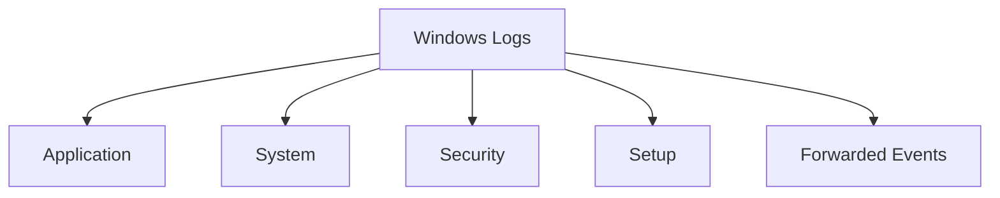

# Log Analysis & Digital Forensics - Comprehensive Notes

## 1. Introduction to Logs and Digital Footprints

### The Concept of Digital Footprints
> **Logs**: Digital footprints left behind by activities on systems and applications

**Analogy**: Just like physical footprints track movement, logs track digital activities

### Critical Use Cases of Logs

| Use Case | Real-World Application | Business Impact |
|----------|------------------------|-----------------|
| **Security Monitoring** | Real-time detection of brute force attacks | Prevents data breaches |
| **Incident Investigation** | Root cause analysis of security incidents | Reduces future risk |
| **Troubleshooting** | Diagnosing application performance issues | Minimizes downtime |
| **Performance Monitoring** | Identifying system bottlenecks | Optimizes resource usage |
| **Auditing & Compliance** | Meeting regulatory requirements (GDPR, HIPAA) | Avoids legal penalties |

**Example: Security Breach Investigation**
```
Incident: Unauthorized access to customer database
Log Evidence: 
- Failed login attempts from unusual IP
- Successful login from suspicious location
- Database query patterns indicating data exfiltration
- Timeline reconstruction of attack steps
```

---

## 2. Log Types and Their Forensic Value

### Comprehensive Log Classification

#### System Logs
**Purpose**: Operating system operations and health monitoring

**Critical Events for Investigation:**
```
1. System Startup/Shutdown Events
   - Unexpected reboots (potential crash or attack)
   - After-hours system activity (suspicious behavior)

2. Driver and Hardware Events
   - Failed hardware components (storage device errors)
   - Driver conflicts (system instability causes)

3. Service Status Changes
   - Critical services stopping unexpectedly
   - Unauthorized service modifications
```

**Real-World Example:**
```
Scenario: Server performance degradation
System Log Evidence:
- Multiple disk I/O errors logged
- Memory allocation failures
- Service crash dumps
Action: Replace failing hardware, prevent system failure
```

#### Security Logs
**Purpose**: Authentication, authorization, and security policy events

**Key Investigation Areas:**
- **Authentication Events**: Success/failure patterns
- **Account Management**: User creation, modification, deletion
- **Policy Changes**: Security configuration modifications
- **Privilege Use**: Elevated access activities

**Incident Detection Example:**
```
Suspicious Pattern: 
- 4625 (Failed logon) events from multiple user accounts
- Followed by 4624 (Successful logon) from same IP
- Then 4672 (Special privileges assigned)
Conclusion: Credential stuffing attack leading to privilege escalation
```

#### Application Logs
**Purpose**: Application-specific activities and errors

**Forensic Value:**
- User interaction tracking
- Application error analysis
- Feature usage patterns
- Integration point failures

**Business Impact Example:**
```
E-commerce Application:
- Payment gateway integration errors
- Shopping cart abandonment patterns
- Inventory update failures
Resolution: Fix integration issues, recover lost sales
```

#### Audit Logs
**Purpose**: Compliance and detailed activity tracking

**Critical for:**
- Regulatory compliance (SOX, PCI-DSS)
- Internal policy enforcement
- Data access monitoring
- Change management validation

**Compliance Scenario:**
```
Requirement: Track all access to financial data
Audit Log Implementation:
- User login/logout tracking
- Database query logging
- File access monitoring
- Report generation for auditors
```

#### Network Logs
**Purpose**: Network traffic and communication monitoring

**Investigation Uses:**
- **Connection Tracking**: Source/destination analysis
- **Bandwidth Monitoring**: Unusual traffic patterns
- **Firewall Events**: Blocked intrusion attempts
- **DNS Queries**: Suspicious domain lookups

**Security Incident Example:**
```
Detection: Unusual outbound traffic to foreign IP
Network Log Evidence:
- Large data transfers during off-hours
- Connections to known malicious IPs
- Protocol anomalies (non-standard ports)
Action: Block malicious IPs, investigate compromised system
```

#### Access Logs
**Purpose**: Resource access tracking across systems

**Types and Applications:**
- **Web Server Access**: HTTP request/response logging
- **Database Access**: Query execution tracking
- **File Server Access**: File open/read/write operations
- **API Access**: REST API call monitoring

**Web Application Security Example:**
```
Attack: SQL Injection attempt
Access Log Evidence:
- POST requests with SQL syntax in parameters
- Error responses revealing database structure
- Multiple rapid requests from same IP
Mitigation: WAF rule update, input validation enhancement
```

---

## 3. Windows Event Log Analysis

### Windows Log Architecture

#### Core Log Categories


#### Event Viewer Navigation
**Access Path**: Start → Event Viewer → Windows Logs

**Interface Components:**
- **Left Panel**: Log category hierarchy
- **Center Panel**: Event list with timestamps
- **Right Panel**: Action options (Filter, Export, Clear)
- **Bottom Panel**: Event details when selected

### Critical Windows Event IDs for Security

#### Authentication Events
| Event ID | Description | Investigation Significance |
|----------|-------------|---------------------------|
| **4624** | Successful logon | Baseline normal behavior, detect anomalies |
| **4625** | Failed logon | Brute force attack indicator |
| **4634** | Account logoff | Session duration analysis |
| **4648** | Logon with explicit credentials | Lateral movement evidence |

#### Account Management Events
| Event ID | Description | Security Implications |
|----------|-------------|----------------------|
| **4720** | User account created | Unauthorized account creation |
| **4722** | User account enabled | Reactivation of disabled accounts |
| **4724** | Password reset attempt | Credential compromise indicator |
| **4725** | User account disabled | Legitimate administrative action |
| **4726** | User account deleted | Covering tracks after intrusion |

#### Practical Investigation Example

**Scenario: Suspected Account Compromise**
```
Step 1: Filter for Event ID 4625 (Failed logons)
- Pattern: Multiple rapid failures for same account
- Source: IP addresses from different geographic locations

Step 2: Check for Event ID 4624 (Successful logons)
- Correlation: Successful login after failure pattern
- Anomaly: Login from unusual location/time

Step 3: Investigate subsequent activities
- Event ID 4627: Group membership changes
- Event ID 4732: Group membership added
- Event ID 4672: Special privileges assigned

Conclusion: Credential stuffing attack with privilege escalation
```

### Advanced Event Viewer Features

#### Filtering and Custom Views
```markdown
# Creating Custom Filters
1. Right-click on log category → "Filter Current Log"
2. Specify criteria:
   - Event IDs: 4624,4625,4648
   - Time range: Last 24 hours
   - Keywords: Specific usernames or IPs
3. Save as Custom View for repeated use

# Exporting for Analysis
1. Select events → Right-click → "Save All Events As..."
2. Choose format: EVTX (native) or CSV (spreadsheet)
3. Import into SIEM or analytics tools
```

#### PowerShell Integration
```powershell
# Get specific event logs
Get-EventLog -LogName Security -InstanceId 4624 -After (Get-Date).AddHours(-24)

# Export events to file
Get-WinEvent -FilterHashtable @{LogName='Security'; ID=4625} | Export-CSV failed_logons.csv

# Real-time monitoring
Get-WinEvent -FilterHashtable @{LogName='Security'} -MaxEvents 10 -Wait
```

---

## 4. Web Server Access Log Analysis

### Apache Access Log Structure

#### Standard Log Format Breakdown
```
172.16.0.1 - - [06/Jun/2024:13:58:44 +0000] "GET /admin HTTP/1.1" 404 196 "-" "Mozilla/5.0 (Windows NT 10.0; Win64; x64)"
```

**Field Analysis:**
- **Client IP**: 172.16.0.1 (Source of request)
- **Timestamp**: [06/Jun/2024:13:58:44 +0000] (UTC time)
- **HTTP Method**: GET (Request type)
- **Requested URL**: /admin (Target resource)
- **HTTP Version**: HTTP/1.1
- **Status Code**: 404 (Not Found)
- **Response Size**: 196 bytes
- **Referrer**: "-" (No referrer)
- **User-Agent**: Browser and OS information

### Critical HTTP Status Codes for Security

#### Security-Related Status Patterns
| Status Code | Normal Meaning | Security Concern |
|-------------|----------------|------------------|
| **200** | OK | Successful access to sensitive areas |
| **301/302** | Redirect | Phishing campaign indicator |
| **401** | Unauthorized | Authentication attempts |
| **403** | Forbidden | Access control testing |
| **404** | Not Found | Directory scanning or broken links |
| **500** | Internal Error | Application vulnerability probing |

### Linux Command-Line Log Analysis Tools

#### cat - Basic File Display
```bash
# View entire log file
cat /var/log/apache2/access.log

# Combine multiple log files
cat access.log access.log.1 > combined_access.log

# Real-world example: Investigating specific time period
cat /var/log/apache2/access.log | grep "06/Jun/2024:14"
```

#### grep - Pattern Searching
```bash
# Search for specific IP address
grep "192.168.1.100" access.log

# Case-insensitive search
grep -i "admin" access.log

# Multiple pattern search
grep -E "admin|login|dashboard" access.log

# Real investigation example: Finding attack patterns
grep -E "(union select|script|\.\./)" access.log
```

#### less - Paged File Viewing
```bash
# View log file with navigation
less /var/log/apache2/access.log

# Navigation commands:
# Spacebar: Next page
# b: Previous page
# /pattern: Search forward
# ?pattern: Search backward
# n: Next match
# N: Previous match

# Real-time monitoring equivalent
tail -f /var/log/apache2/access.log
```

### Advanced Log Analysis Techniques

#### awk - Field Extraction and Processing
```bash
# Extract specific fields (IP addresses)
awk '{print $1}' access.log | sort | uniq -c | sort -nr

# Analyze status code distribution
awk '{print $9}' access.log | sort | uniq -c

# Real investigation: Top requested URLs
awk '{print $7}' access.log | sort | uniq -c | sort -nr | head -10
```

#### sed - Stream Editing
```bash
# Filter by time range
sed -n '/06\/Jun\/2024:14:00:/,/06\/Jun\/2024:15:00:/p' access.log

# Extract specific request types
sed -n '/POST \/login/p' access.log
```

### Real-World Web Attack Investigation

#### Case Study: Brute Force Attack on Login Page
```bash
# Step 1: Identify login attempts
grep "POST /login" access.log > login_attempts.log

# Step 2: Analyze by IP frequency
awk '{print $1}' login_attempts.log | sort | uniq -c | sort -nr

# Step 3: Check for successful logins (status 200 after POST)
grep -A1 "POST /login" access.log | grep " 200 "

# Step 4: Timeline analysis
grep "192.168.1.50" access.log | awk '{print $4}' | sort

# Findings:
# - IP 192.168.1.50: 150 login attempts in 5 minutes
# - Multiple failed attempts (status 401)
# - One successful login (status 200)
# - Subsequent access to admin areas
```

#### SQL Injection Detection
```bash
# Common SQL injection patterns
grep -E "('|--|union|select|from|where)" access.log

# Detailed analysis of suspicious requests
grep "union select" access.log | awk '{print $1, $7, $9}'

# Real example from investigation:
# 203.0.113.45 - GET /products?id=1' UNION SELECT username,password FROM users--
```

### Log Management Best Practices

#### Centralized Log Collection
```markdown
# Benefits of Centralization
- Correlated analysis across systems
- Single point for monitoring
- Historical data retention
- Compliance reporting

# Implementation Tools
- SIEM solutions (Splunk, ELK Stack)
- Cloud logging services (AWS CloudWatch, Azure Monitor)
- Open-source alternatives (Graylog, Logstash)
```

#### Log Retention Strategy
```markdown
# Retention Period Considerations
- **Security Investigations**: 1+ years
- **Compliance Requirements**: 3-7 years
- **Performance Monitoring**: 30-90 days
- **Debugging**: 7-30 days

# Storage Optimization
- Log rotation policies
- Compression of historical logs
- Tiered storage (hot/warm/cold)
```

### Automation and Alerting

#### Proactive Monitoring Scripts
```bash
#!/bin/bash
# Real-time suspicious activity monitor
tail -f /var/log/apache2/access.log | while read line; do
    if echo "$line" | grep -qE "(\.\./|union select|/etc/passwd)"; then
        echo "ALERT: Suspicious request detected: $line" | mail -s "Web Attack Alert" admin@company.com
    fi
done
```

